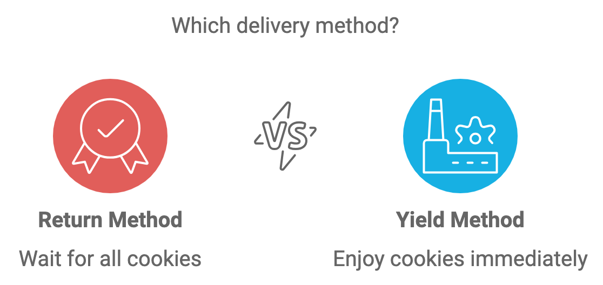

### Understanding the Differences Between `return` and `yield` in Python: A Story

In Python, both `return` and `yield` are used in functions, but they work very differently. Let’s understand this through a simple story.

---

#### The Tale of the Baker

Imagine a baker, Sarah, who is baking cookies for her neighbors. She has two different ways to deliver the cookies:

- **The `return` way:** Sarah bakes all the cookies in one go. Once every single cookie is baked, she puts them all in a large basket and gives the entire basket to you. You only get the cookies *after* all of them are ready. This is like `return`—the function does all its work and then returns the result at once.

- **The `yield` way:** Instead of making you wait for all the cookies to be done, Sarah gives you one cookie as soon as it comes out of the oven. As each cookie is baked, she immediately hands it to you. This way, you can start enjoying cookies while she continues baking. This is like `yield`—it returns a value at each step and remembers where it left off, so it can pick up from there later.




---

### Key Differences

- **`return` ends the function**: When a function hits `return`, it completes its execution and returns a value. The function can’t return anything else after that.
  
- **`yield` pauses the function**: When a function hits `yield`, it pauses and gives you a value. The function can be resumed and keep yielding more values without starting over.

### Example

Let's use Python to show the difference.

#### 1. Using `return`:

```python
def bake_cookies_return():
    cookies = []
    for i in range(1, 6):
        cookies.append(f"Cookie {i}")
    return cookies

# Calling the function
cookies = bake_cookies_return()
print(cookies)  # ['Cookie 1', 'Cookie 2', 'Cookie 3', 'Cookie 4', 'Cookie 5']
```

- Sarah bakes all 5 cookies, then hands them all at once. You only get the cookies after everything is done.

#### 2. Using `yield`:

```python
def bake_cookies_yield():
    for i in range(1, 6):
        yield f"Cookie {i}"

# Calling the function
for cookie in bake_cookies_yield():
    print(cookie)  # Cookie 1, Cookie 2, Cookie 3, ...
```

- Sarah gives you each cookie as soon as it's ready. You get cookies one at a time while she continues baking.

### Conclusion

- **`return`** is like delivering everything at once: the function stops after returning the result.
- **`yield`** is like streaming: it gives you results piece by piece without waiting for the whole process to finish.

Use `return` when you want a function to give back a final result. Use `yield` when you want to handle data one item at a time and don’t need the function to finish all at once.

Link for markdown [Markdown](https://github.com/maiphong0411/phongkamy/blob/main/_posts/2024-09-24-yield-and-return-in-python.md)